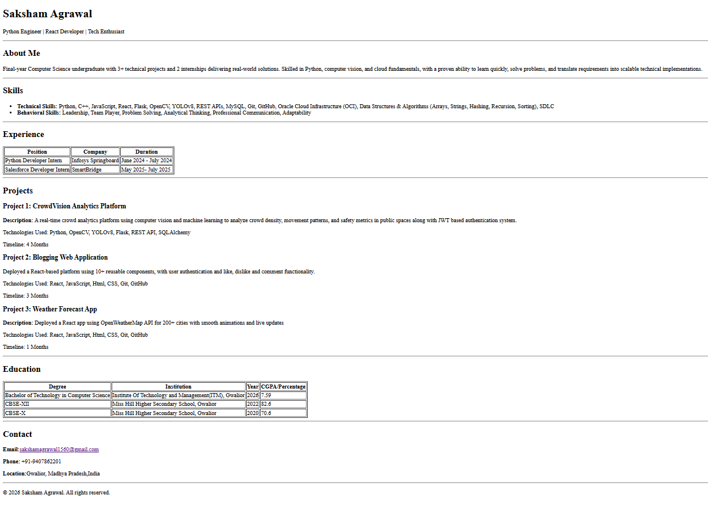

# Single Paged Resume Webpage – Saksham Agrawal
Single-page resume website only using HTML

## Overview
This is a single-page resume website built using pure HTML. It includes sections like About, Skills, Experience, Projects, Education, and Contact.

## Features
- Semantic HTML structure
- Tables for experience and education
- Clean and readable layout
- No CSS used (as per assignment instructions)

## How to Run
1. Download index.html
2. Open in any browser

## Screenshot

## Author
Saksham Agrawal
